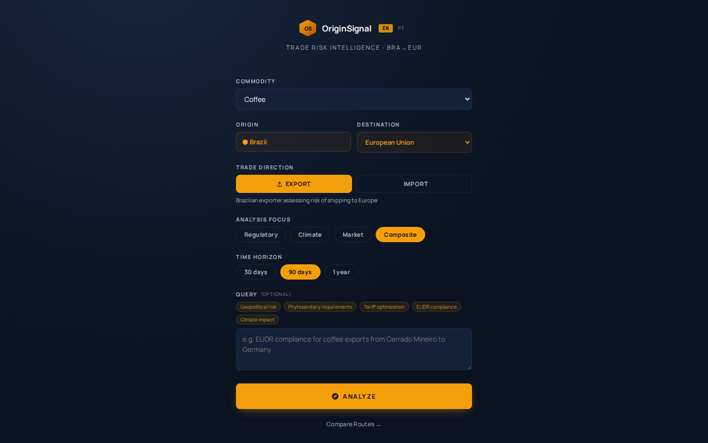
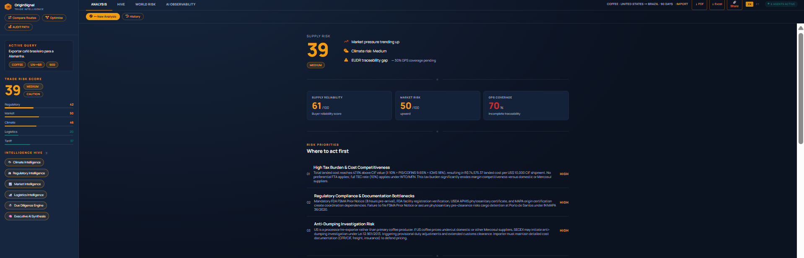
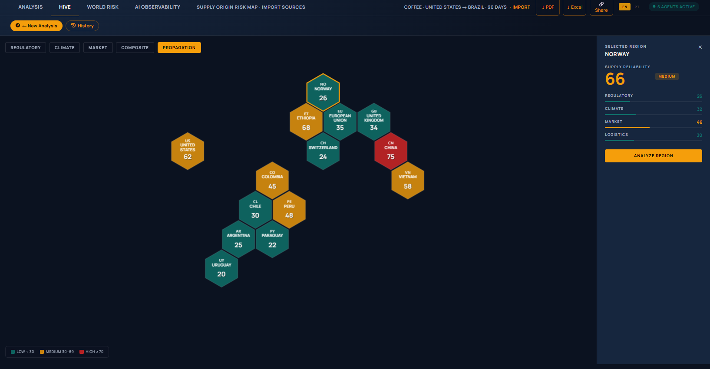
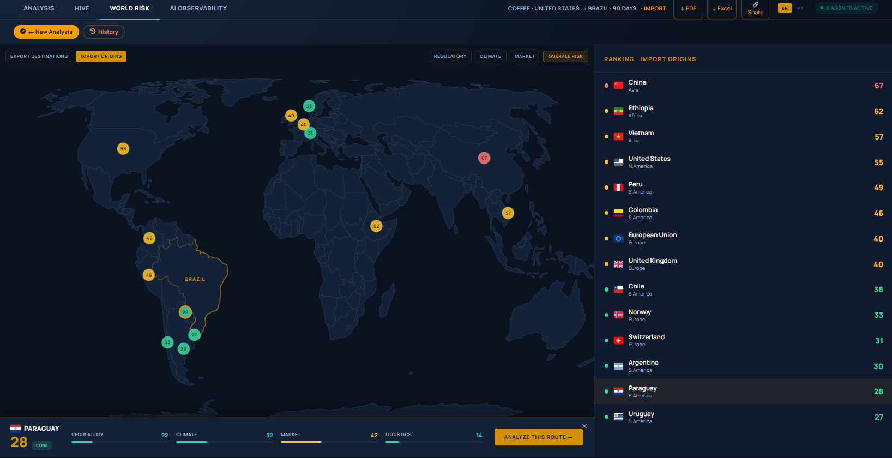

# OriginSignal — Trade Risk Intelligence Platform

> *"O Siscomex é onde você declara. O OriginSignal é onde você decide se deve declarar."*

OriginSignal is a multi-agent AI platform for trade risk intelligence — built for Brazilian exporters and importers who need to make decisions about international trade routes, regulatory compliance, and supply chain risk.

---

## Screenshots






---

## The Problem

When someone needs to analyze a trade route, they open five different sources:
- A spreadsheet for tariff calculations
- A government website for regulatory requirements
- A market report for pricing trends
- A climate forecast for production risk
- A logistics portal for transit times

Everything exists. Nothing is connected.

OriginSignal connects all of it — in about 30 seconds.

---

## Architecture

```
┌─────────────────────────────────────────────────────────┐
│                React + TypeScript Frontend               │
│   Landing → Processing Animation → Strategic Dashboard  │
└─────────────────────┬───────────────────────────────────┘
                      │ REST API
┌─────────────────────▼───────────────────────────────────┐
│                   FastAPI Backend                        │
│                                                         │
│  ┌──────────────────────────────────────────────────┐  │
│  │         6 Intelligence Agents (parallel)          │  │
│  │                                                   │  │
│  │  🌦 Climate Intelligence   → Open-Meteo API       │  │
│  │  ⚖  Regulatory Intelligence → RAG + Claude Haiku │  │
│  │  📈 Market Intelligence    → USDA FAS PSD         │  │
│  │  🚢 Logistics Intelligence → ANTAQ + DHL Index    │  │
│  │  🐝 Due Diligence Engine   → Honeycomb algorithms │  │
│  │  🧠 Executive AI Synthesis → Claude Sonnet 4.6   │  │
│  └──────────────────────────────────────────────────┘  │
│                                                         │
│  ┌─────────────┐  ┌─────────────┐  ┌───────────────┐  │
│  │  ChromaDB   │  │   MongoDB   │  │  RAG Engine   │  │
│  │  (vectors)  │  │  (history)  │  │  465 chunks   │  │
│  └─────────────┘  └─────────────┘  └───────────────┘  │
└─────────────────────────────────────────────────────────┘
```

### Key Technical Decisions

**Deterministic calculations, not LLM math:**
All risk scores, tariff calculations (II + IPI + PIS/COFINS + ICMS), Honeycomb algorithms, and optimization routines are computed in Python. The LLM receives pre-calculated numbers and writes the executive narrative. It interprets results — it doesn't do the math.

**Parallel agent execution:**
Six agents run simultaneously via `asyncio.gather`. The Executive AI Synthesis agent receives all five JSON outputs and synthesizes them — fan-in pattern.

**Selective RAG:**
The RAG pipeline only activates for EU-bound routes (where EUDR applies). Other destinations use prompt-injected context, saving tokens and latency.

**Context injection for grounding:**
Current date, calculated tax rates, and agent outputs are injected into the Executive Agent prompt. This prevents temporal hallucinations and ensures the narrative reflects the actual computed values.

---

## The Honeycomb Conjecture — Applied

OriginSignal applies the **Honeycomb Conjecture** (Hales, 1999) as a decision engine — not just as a visual metaphor.

The conjecture proves that hexagonal tiling provides maximum area coverage with minimum perimeter. Applied to trade risk:

### 1. Honeycomb Efficiency Score (HES)
```
HES = (volume in LOW-RISK cells / total volume) × 100
```
Measures what % of exportable volume is in low-risk hexagonal cells. Dynamic by commodity and trade direction.

### 2. Cellular Risk Propagation
Risk propagates between adjacent hexagonal cells based on geographic proximity — a drought in Cerrado Mineiro influences neighboring Sul de Minas and Triângulo MG.

### 3. Honeycomb Optimization Engine
```
Greedy optimization over hexagonal adjacency graph
→ Maximize volume unlocked per R$ invested
```
Given a regularization budget, selects regions by ROI to maximize safe export coverage.

### 4. Minimum Coverage Path (Audit Path)
```
Nearest-neighbor TSP heuristic over hexagonal adjacency graph
→ Minimize total audit distance while maximizing EUDR compliance coverage
```

---

## RAG — Retrieval Augmented Generation

| Document | Chunks | Source |
|----------|--------|--------|
| EUDR 2023/1115 | 392 | EUR-Lex (official PDF) |
| Brazil Import Guide | 17 | ANVISA/MAPA regulations |
| Brazil Tariff Guide | 19 | MDIC/Receita Federal |
| USA Export Guide | 12 | USDA APHIS/FDA FSMA |
| China Export Guide | 13 | GACC/CIQ requirements |
| LATAM Export Guide | 12 | Mercosul/ACE agreements |
| **Total** | **465** | |

Embeddings: `sentence-transformers/all-MiniLM-L6-v2` (local, no API cost)
Vector store: ChromaDB (local — not tracked in git)

**Rebuild after cloning:**
```bash
cd backend && python -m app.rag.ingest
```

---

## Features

### Trade Analysis
- **Export:** Brazil → EU, USA, China, Japan, South Korea, Norway, Switzerland, UK, Argentina, Colombia, Chile, Peru, Uruguay, Paraguay, Mexico, Saudi Arabia, UAE
- **Import:** USA, China, EU, Norway, Switzerland, UK, Argentina, Colombia, Peru, Chile, Uruguay, Paraguay, Vietnam, Ethiopia → Brazil
- **Commodities:** Coffee, Soybeans, Fruits
- **Time horizons:** 30 days, 90 days, 1 year

### Dashboard — 4 Tabs
- **Analysis** — Executive Memorandum with risk priorities, recommended actions, tariff calculation, HES, Cellular Risk Propagation, Trade Route
- **Hive** — Interactive hexagonal map of Brazilian producing regions with risk propagation layer
- **World Risk** — Global risk heat map with country ranking by score
- **AI Observability** — Full pipeline transparency: agent timing, token usage, RAG evidence, decision trace

### Optimization Tools
- **Route Comparator** — Side-by-side landed cost comparison across origins
- **Honeycomb Optimizer** — Budget → optimal regions by ROI
- **Audit Path** — Minimum coverage route for EUDR certification missions

### Regulatory Alerts
- Real-time monitoring via EUR-Lex RSS
- RASFF (EU food safety alerts) integration

### Additional
- Export PDF + Excel reports
- MongoDB analysis history with persistent URLs
- EN/PT bilingual interface

---

## Tech Stack

### Backend
| Component | Technology |
|-----------|-----------|
| API | FastAPI + Uvicorn |
| AI Agents | Claude Haiku 4.5 (5 agents) + Claude Sonnet 4.6 (Executive) |
| RAG | ChromaDB + sentence-transformers (local) |
| Database | MongoDB (Motor async) |
| PDF export | reportlab |
| Excel export | openpyxl |

### Frontend
| Component | Technology |
|-----------|-----------|
| Framework | React + TypeScript |
| Build | Vite |
| Map | Canvas API (hexagonal grid) |
| i18n | Custom EN/PT translation system |

### Data Sources
| Source | Data | Frequency |
|--------|------|-----------|
| Open-Meteo | Climate forecast + historical | Real-time |
| USDA FAS PSD | Agricultural market data | Monthly |
| EUR-Lex | EUDR regulatory text | Static (2023) |
| EUR-Lex RSS | Regulatory alerts | Real-time |
| RASFF API | Food safety alerts | Real-time |
| ExchangeRate API | USD/BRL | Real-time |
| DHL Logistics Index | Port congestion | Monthly |

---

## Risk Score Formula

**Export:**
```
Score = Regulatory×30% + Climate×25% + Market×20% + Logistics×15% + Gap×10%
```

**Import:**
```
Score = Regulatory×25% + Climate×20% + Market×15% + Logistics×15% + Tariff×15% + Gap×10%
```

Tariff calculation (Python, deterministic):
```
CIF → II (with trade agreement reduction) → IPI → PIS/COFINS → ICMS (gross-up)
Landed Cost = CIF + II + IPI + PIS/COFINS + ICMS
```

---

## Running Locally

### Prerequisites
- Python 3.11+
- Node.js 20+
- Docker (for MongoDB)
- Anthropic API key

### Setup

```bash
# Clone
git clone https://github.com/beatrizcoder/originsignal
cd originsignal

# MongoDB
docker run -d --name originsignal_mongo -p 27017:27017 mongo:7

# Backend
cd backend
python -m venv .venv
source .venv/bin/activate
pip install -r requirements.txt

# Build RAG index (required)
python -m app.rag.ingest

# Environment variables
cp .env.example .env
# Add your ANTHROPIC_API_KEY

# Start backend
uvicorn app.main:app --host 0.0.0.0 --port 8000 --reload

# Frontend (new terminal)
cd frontend
npm install
npm run dev
```

### Quick start
```bash
chmod +x dev-start.sh && ./dev-start.sh
```

---

## API Endpoints

| Method | Endpoint | Description |
|--------|----------|-------------|
| POST | `/api/analyze` | Full trade risk analysis |
| GET | `/api/history` | Analysis history |
| GET | `/api/history/{id}` | Single analysis by ID |
| POST | `/api/compare` | Route comparator |
| POST | `/api/optimize` | Honeycomb optimizer |
| POST | `/api/audit-path` | Minimum coverage path |
| GET | `/api/global-risk/{commodity}` | World risk heat map |
| GET | `/api/honeycomb/{commodity}` | HES score |
| GET | `/api/alerts/{commodity}` | Regulatory alerts |
| POST | `/api/export/pdf` | PDF report |
| POST | `/api/export/excel` | Excel report |

---

## Data Transparency

| Source | Status | Notes |
|--------|--------|-------|
| Climate (Open-Meteo) | ✅ Real-time | Live API |
| Regulatory (EUR-Lex) | ✅ Real | Official PDF, 2023 |
| Exchange rate | ✅ Real-time | Live API |
| Regulatory alerts | ✅ Real-time | EUR-Lex RSS + RASFF |
| USDA FAS market data | ⚠️ Estimated | Monthly delay + fallback |
| Region volumes | ⚠️ Estimated | MAPA/CONAB public data |
| Regularization costs | ⚠️ Estimated | Market reference |
| GPS coverage | ❌ Demo | Would come from ERP in production |
| Supplier profile | ❌ Demo | Would come from ERP in production |

The architecture is fully pluggable — production deployment would connect to ERP systems, real supplier databases, and live pricing APIs.

---

## Roadmap

### V2
- [ ] H3 (Uber Hexagonal Index) for GPS-level farm data
- [ ] LLM-agnostic architecture (Ollama, Groq as alternatives)
- [ ] Real-time pricing (CEPEA/ESALQ)
- [ ] SAP/ERP integration for supplier data

### V3
- [ ] Multi-country origin support with full RAG
- [ ] Real production volume data (MAPA/CONAB API)
- [ ] Audit mission scheduling
- [ ] Mobile app

---

## About

Built by **Beatriz Costa** — Senior Business Analyst & Generative AI Initiative Lead

This project is the intersection of four areas of my career:
- **International Trade** — the problem domain, lived experience
- **Business Analysis** — decision modeling, stakeholder requirements
- **AI Engineering** — multi-agent systems, RAG, LLMs
- **Mathematics** — Honeycomb Conjecture applied as real optimization algorithms

> The Honeycomb Conjecture isn't decoration here. It's the mathematical foundation for four real algorithms: efficiency scoring, risk propagation, resource allocation optimization, and minimum coverage path. Maximum coverage, minimum resource.

**Portfolio:** [beatrizcoder.github.io](https://beatrizcoder.github.io)
**LinkedIn:** [linkedin.com/in/beatrizcosta](https://linkedin.com/in/beatrizcosta)

---

*Powered by Claude Sonnet 4.6 · Open-Meteo · USDA FAS · EUR-Lex EUDR 2023/1115*
